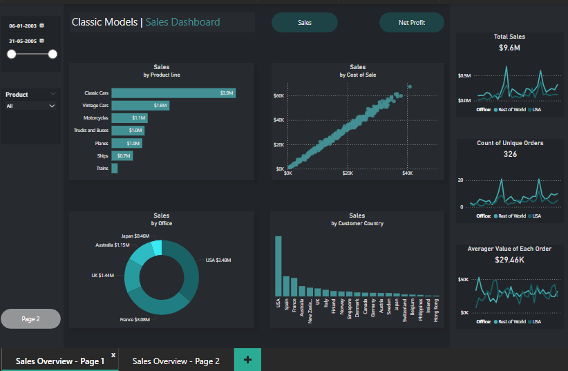

# 📊 Classic Model Sales Dashboard | Global Sales Overview

## Introduction  
Ever wondered how different product lines perform across global markets? This Power BI dashboard dives into historical sales data of classic model products, offering an interactive and insightful view into regional sales performance, product trends, and profitability metrics across time.

Built with Power BI, this dashboard transforms raw sales data into a visually compelling narrative that supports decision-making and trend analysis.

📍 View the dashboard here: [ClassicModelData](/ClassicModelSalesData.pbix)

---

## Background  
Classic Models is a fictional company selling collectible scale models worldwide. This dashboard is designed to help stakeholders understand which product lines and regions drive sales, how performance varies across time, and where strategic opportunities may lie.

The dataset includes customer details, orders, and revenue across multiple countries from 2003–2005.

---

## Objectives  
This dashboard seeks to explore:

- 🚗 Which product lines generate the most revenue?  
- 🌍 How do sales vary across countries and offices?  
- 📈 What is the trend of sales over the years?  
- 💰 Which customer regions contribute the highest net profits?  
- 🧾 How does the cost of sale relate to the revenue generated?

---

## Tools I Used  
🧰 Here's the tech stack behind the dashboard:

- Power BI Desktop: For crafting the interactive dashboard and visuals  
- Excel (CSV): Data preparation and transformation  
- DAX: For custom measures, KPIs, and calculated fields  
- Git & GitHub: Version control and project collaboration  

---

## The Analysis

### 🧮 Sales by Product Line  
Classic Cars dominate the market, followed by Vintage Cars and Motorcycles. Tanks and Ships are among the least sold.

### 💼 Sales by Office & Country  
USA leads in office-wise sales, while Japan and Australia follow. Sales by customer country show a strong presence in the USA, Japan, and Germany.

### 🧭 Customer Analysis  
Customer-level breakdowns highlight top contributors to revenue, segmented by country and product line, using Sankey visualizations.

### 📅 Year-Month Overview  
The matrix visual provides monthly sales value, year-to-date comparisons, and growth rates, showcasing business seasonality and peak periods.

### 📈 Trendlines  
- Net profit analysis by region  
- Sales vs. cost relationships  
- Unique order counts over time  
- Average order value trends  

---

## What I Learned  
This project sharpened my Power BI and data storytelling skills:

- 📊 Mastered multi-tab dashboard creation  
- ⚙️ Improved KPI calculation using DAX  
- 📈 Enhanced temporal trend analysis and data segmentation  
- 🧠 Learned effective use of slicers, filters, and dynamic visuals for user-driven insights

---

## Conclusions

### 📌 Key Insights:
- Classic Cars remain the top-performing product line.
- USA and Japan are critical sales markets.
- Sales peaked around late 2004 and early 2005.
- There's a clear correlation between sales value and cost, showing consistent profit margins.
- Customer segmentation reveals valuable buyers and low-contributing regions for potential strategy shifts.

---

## 🚀 Final Thoughts  
This dashboard is a robust sales analysis tool that empowers stakeholders to understand historical patterns, uncover sales opportunities, and guide business strategy. Power BI’s flexibility makes it easy to scale this analysis for larger datasets and real-time monitoring.

Let me know if you want a simplified version or if you're planning to convert it into a PDF as well.
